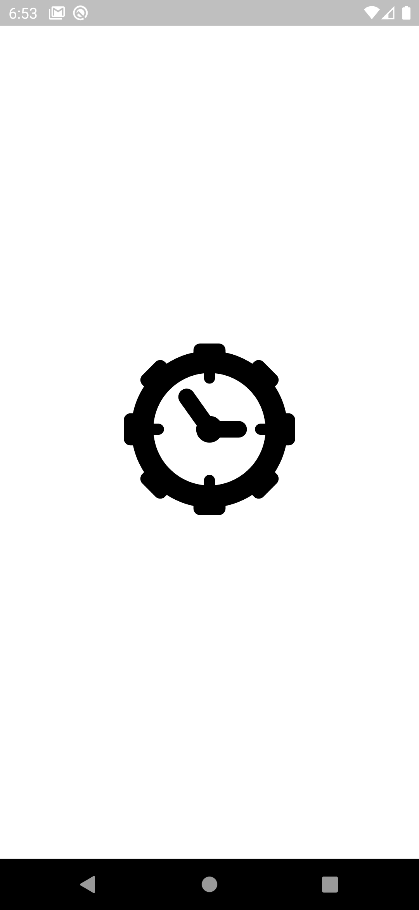
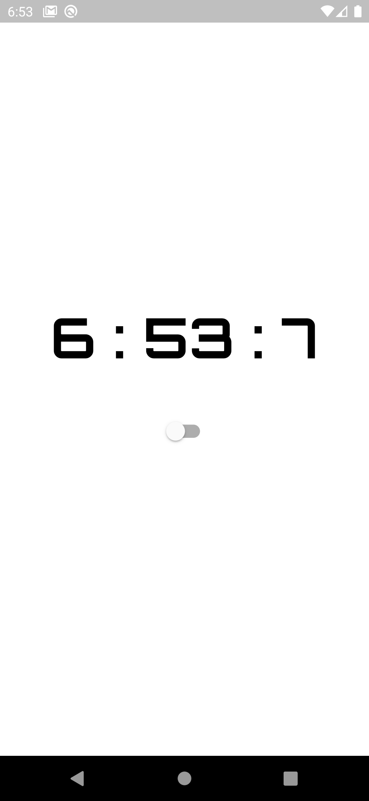
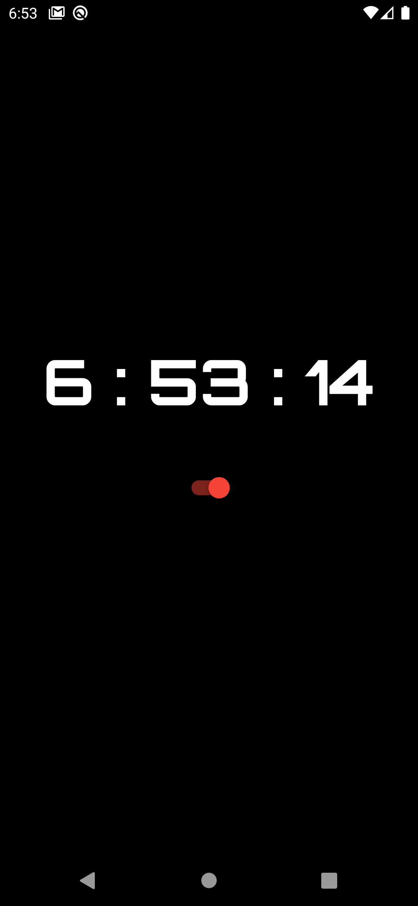

# Nepali App Template

 This is simple time showing app using getx and shared preferences. Shared Preference is used to keep record of the theme.

## Screens it contains:

=> Onboarding

=> Time Screen

## Packages used:

=> get (for state management)

=> shared_preferences (for persistence)

=> google_fonts (for custom font)

=> intl (for date format)

## Photos

